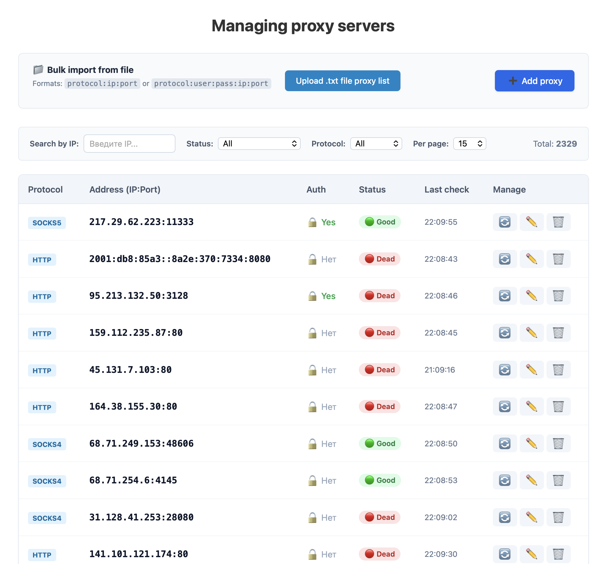
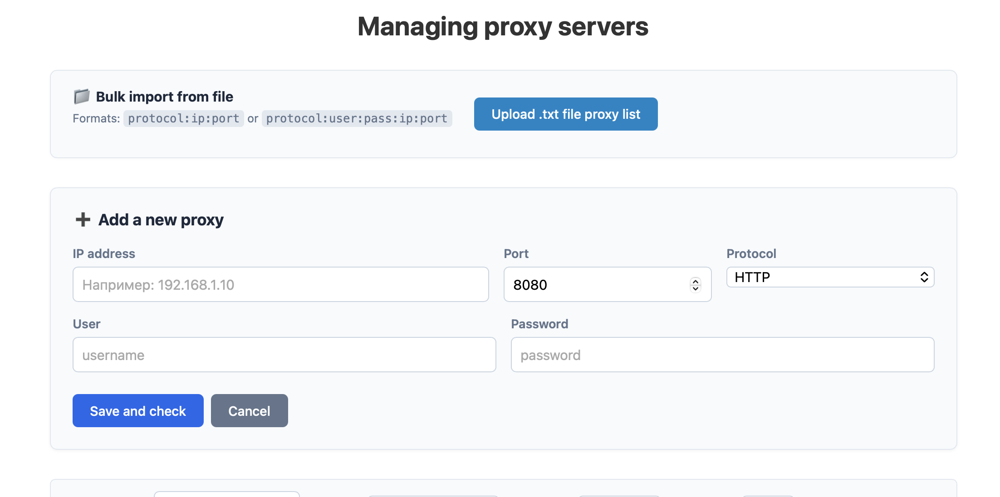

# laravel-proxy-manager


# Proxy Manager (Laravel 12 + Vue 3 SPA)

Небольшое высокопроизводительное SPA-приложение для массового импорта, валидации и мониторинга работоспособности прокси-серверов в реальном времени.

## 📸 Скриншоты интерфейса

### Главная панель управления


### Массовый импорт из файла


## 🚀 Стек технологий

- **Backend:** PHP 8.4, Laravel 12 (REST API, асинхронные очереди, планировщик задач)
- **Frontend:** Vue 3 (Composition API, `<script setup>`, Vite)
- **Database:** MySQL 8.4
- **Containerization:** Docker, Docker Compose
- **Network Engine:** Native PHP cURL (`CURLPROXY_SOCKS5_HOSTNAME`)

---

## 🏗️ Архитектура и Особенности

1. **Тонкие Контроллеры и Сервисный Слой (SOLID):** Вся бизнес-логика изолирована. За парсинг файлов отвечает `ProxyImportService`, а за низкоуровневые сетевые запросы — `ProxyCheckerService`.
2. **Асинхронность и Очереди (Queue Jobs):** Проверка прокси вынесена в фоновые задачи `CheckProxyJob`. При импорте или обновлении интерфейс не зависает — задачи мгновенно улетают в очередь базы данных, разгружая основной поток.
3. **Умная пагинация (Sliding Pagination):** На фронтенде реализовано скользящее окно страниц с многоточиями (`...`), позволяющее комфортно перемещаться по спискам из тысяч записей.
4. **Всеядный Сетевой Чеккер:** Нативный cURL настроен с поддержкой `socks5h` (резолв DNS на стороне прокси) и `CURLAUTH_BASIC`. Это гарантирует 100% определение статуса даже капризных покупных/приватных резидентских прокси из-под Docker-контейнера. Целевые URL для проверки гибко вынесены в настройки `.env`.

---

## 📁 Структура проекта

```text
├── backend/            # Исходный код API на Laravel 12
├── frontend/           # Исходный код SPA на Vue 3
├── docker/
│   └── nginx.conf      # Конфигурация веб-сервера Nginx для API
└── docker-compose.yml  # Главный файл оркестрации контейнеров
```

---

## ⚙️ Пошаговое развертывание (Установка)

### 1. Клонирование и подготовка окружения
Убедитесь, что у вас установлены Docker и Docker Compose. Создайте файлы конфигурации бэкенда:

```bash
cd backend
cp .env.example .env
```

Откройте `backend/.env` и пропишите настройки базы данных и целевые сайты для пинга:
```env
DB_CONNECTION=mysql
DB_HOST=db
DB_PORT=3306
DB_DATABASE=laravel_db
DB_USERNAME=laravel_user
DB_PASSWORD=secret_user_pass

# Список эндпоинтов для проверки прокси (через запятую)
PROXY_CHECK_TARGETS=https://datahunter.store
```

### 2. Запуск контейнеров
Вернитесь в корень проекта и поднимите Docker-стек:
```bash
cd ..
docker compose up -d --build
```

### 3. Настройка бэкенда Laravel
Установите зависимости, сгенерируйте ключ, накатите таблицы и включите API-модуль:
```bash
docker compose exec backend composer install
docker compose exec backend php artisan key:generate
docker compose exec backend php artisan install:api
# На вопрос "Would you like to run all pending database migrations?" введите yes
```

### 4. Создание таблиц приложения
Сгенерируйте и запустите миграцию для прокси:
```bash
docker compose exec backend php artisan make:migration create_proxies_table
```
*(Убедитесь, что в миграцию добавлен уникальный индекс `table->unique(['ip', 'port'])`)*.

Примените изменения:
```bash
docker compose exec backend php artisan migrate
```

### 5. Запуск фоновых процессов (Обязательно)
Чтобы прокси проверялись автоматически каждые 5 минут и обрабатывались асинхронные очереди, откройте два параллельных окна терминала и запустите воркеры:

* **Окно 1 (Воркер очередей):**
  ```bash
  docker compose exec backend php artisan queue:work
  ```
* **Окно 2 (Планировщик задач):**
  ```bash
  docker compose exec backend php artisan schedule:work
  ```

Теперь приложение полностью готово!
- **Интерфейс Vue 3:** `http://localhost:3000`
- **REST API Laravel:** `http://localhost:8080/api/proxies`

---

## 📁 Форматы массового импорта файлов (.txt)

Парсер автоматически очищает строки от лишних пробелов, скрытых символов переноса строк (`\r\n`) и URL-слэшей (`://`). Допускается одновременное смешивание следующих форматов в одном файле:

1. **IPv4 / IPv6 без авторизации:**
   ```text
   socks5://208.102.51.6:58208
   http:[2001:db8:85a3::8a2e:370:7334]:58208
   https:185.22.44.11:8080
   ```
2. **IPv4 / IPv6 с авторизацией (логин и пароль):**
   ```text
   http:manager3:pass12345:95.213.132.50:3128
   socks5:[2a02:6b8:b010:7007::1]:3128:user:pass
   ```

---

## 🧪 Тестирование и Безопасность

Тестовое окружение полностью изолировано от боевой базы данных MySQL и использует быструю SQLite в памяти (`:memory:`), исключая риск затирания рабочих данных.

### 1. Создание безопасного конфигуратора тестов
Внутри папки `backend/` создайте приватный файл `.env.testing`. Он автоматически скрыт от коммитов в `.gitignore`:

```env
APP_KEY=base64:скопируйте_ваш_ключ_из_основного_env...

DB_CONNECTION=sqlite
DB_DATABASE=:memory:

# Данные вашего личного покупного прокси для живого теста cURL
TEST_PROXY_IP=185.22.44.11
TEST_PROXY_PORT=8080
TEST_PROXY_TYPE=socks5
TEST_PROXY_USER=my_login
TEST_PROXY_PASS=my_password
```

### 2. Запуск тестов

- **Запустить абсолютно все тесты проекта (API, Валидация, Импорт, Поиск):**
  ```bash
  docker compose exec backend php artisan test
  ```
- **Запустить изолированный тест массового импорта форматов:**
  ```bash
  docker compose exec backend php artisan test tests/Feature/ProxyImportTest.php
  ```
- **Запустить живой Unit-тест низкоуровневой cURL-пробиваемости:**
  ```bash
  docker compose exec backend php artisan test tests/Unit/ProxyLiveCheckTest.php
  ```
